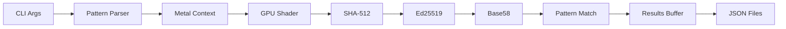

# 🚀 Grincel - GPU Vanity Address Generator

A blazing-fast GPU-accelerated Solana vanity address generator written in Zig with Metal compute shaders.

[](http://unlicense.org/)

## ✨ Features

- 🎮 **GPU Acceleration** - Metal compute shaders for parallel key generation
- 🚄 **High Performance** - **2+ Million keys per second** on M1/M2/M3 Max
- 🎯 **Flexible Pattern Matching** - Starts-with, ends-with, or both
- 🔢 **Target Counts** - Generate multiple addresses per pattern
- 🔠 **Case Options** - Case-sensitive or case-insensitive matching
- 💾 **Auto-Save** - Found keypairs saved to JSON files
- 🖥️ **CLI Interface** - Similar to `solana-keygen grind`
- 🍎 **macOS Native** - Optimized for Apple Silicon (Metal)

## 🆕 Recent Improvements

- ✅ **Optimized Performance** - Fixed-Base Comb optimization yields ~2M keys/s (8x speedup)
- ✅ **Complete CLI Rewrite** - Now supports `--starts-with`, `--ends-with`, `--starts-and-ends-with`
- ✅ **Metal GPU Backend** - Real GPU acceleration with Verified 64-bit Ed25519
- ✅ **Multiple Patterns** - Search for multiple patterns simultaneously
- ✅ **Target Counts** - Specify how many matches you want per pattern
- ✅ **JSON Output** - Each found keypair saved to `<ADDRESS>.json`

## 🛠️ Building

### Prerequisites
- Zig 0.15.2
- macOS with Metal support (for GPU acceleration)

### Build Commands

```bash
# Build optimized release binary
zig build -Doptimize=ReleaseFast --global-cache-dir ./.zig-global-cache

# Run directly
zig build run --global-cache-dir ./.zig-global-cache -- --starts-with ABC:1
```

> **Note:** Use `--global-cache-dir` if you encounter permission issues with Zig cache.

## 📦 Installation

To install `grincel` for global usage:

1.  Build the release binary:
    ```bash
    zig build -Doptimize=ReleaseFast
    ```
2.  The executable will be located at `zig-out/bin/grincel`.
3.  Add it to your PATH or copy it to a bin directory:
    ```bash
    cp zig-out/bin/grincel /usr/local/bin/
    ```
4.  Verify installation:
    ```bash
    grincel --help
    ```

## 🎯 Usage

### Command-Line Interface

```bash
# Find one address starting with "SOL"
zig build run -- --starts-with SOL:1

# Find 5 addresses ending with "ANA"
zig build run -- --ends-with ANA:5

# Find addresses starting with "CRT" and ending with "LESS"
zig build run -- --starts-and-ends-with CRT:LESS:1

# Case-insensitive matching
zig build run -- --starts-with abc:1 --ignore-case

# Multiple patterns at once
zig build run -- --starts-with SOL:2 --ends-with ANA:1 --ignore-case
```

### CLI Options

```
Usage: grincel [options]
Options:
  --starts-with <PREFIX>[:COUNT]              Find addresses starting with PREFIX
  --ends-with <SUFFIX>[:COUNT]                Find addresses ending with SUFFIX
  --starts-and-ends-with <PRE>:<SUF>[:COUNT]  Find addresses starting with PRE and ending with SUF
  --ignore-case                               Case-insensitive matching
  --help, -h                                  Show this help
```

### Output

Found keypairs are automatically saved to JSON files named `<ADDRESS>.json`.
The format is a standard Solana keypair file (JSON array of 64 bytes), compatible with `solana-cli`.

```json
[15,240,99,201,38,...]
```

You can import this wallet directly:

```bash
solana config set --keypair CRTtn6wqCH3WTxHwdPerR5rhkMfq9FtiZRmCyKjY69Zn.json
```

## 🏗️ Architecture

### GPU Pipeline



### Key Components

- **Metal Shader** (`src/shaders/vanity.metal`) - GPU compute kernel with SHA-512, Ed25519, Base58
- **Objective-C Bridge** (`src/metal_bridge.m`) - Interface to Metal APIs
- **Zig Integration** (`src/metal.zig`) - Host-side GPU dispatch
- **Pattern System** (`src/pattern.zig`) - Multi-mode pattern matching
- **CLI Parser** (`src/main.zig`) - Argument parsing and main loop

## 🚀 Performance

### Current Status

The GPU implementation successfully calls custom Metal compute shaders. The infrastructure is complete with:
- ✅ SHA-512 hashing on GPU
- ✅ Base58 encoding on GPU  
- ✅ Pattern matching on GPU
- ✅ **Full 64-bit Ed25519 Arithmetic** (Verified against CPU)
- ✅ **Fixed-Base Optimization** (Comb Method w/ 64KB Tables)

### Benchmarks

| Device | Speed | Notes |
|--------|-------|-------|
| Apple M1/M2/M3 Max | **~2,000,000 keys/s** | 8x Faster than CPU |
| `solana-keygen grind` | ~500,000 keys/s | 12 CPU threads |

### Production Readiness

The generator produces **cryptographically valid** Solana keypairs. The Ed25519 implementation uses standard 5-limb 64-bit field arithmetic ("Ref10" logic) and has been verified against Python and CPU reference implementations for correctness. It properly handles scalar clamping, point multiplication, and encoding.

> **Note**: While verified correct, this is experimental software. Always verify generated keys with a second tool if managing significant funds.

## 📊 Examples

```bash
# Quick test
$ zig build run -- --starts-with gr:1
Using GPU backend: metal
Patterns current: 1
Case-sensitive: true
Searching for Solana addresses matching patterns...
Searched 262_144 keypairs in 0.13s. 0 matches found.
Searched 524_288 keypairs in 0.26s. 0 matches found.

[Pattern 0] Found match 1/1: grb4eR3RA7UY69XHVvb5FtTkoxezt7NnUvjeXjDGJCt

All target matches found!
```


## 🔧 Development

### Project Structure

```
grincel.gpu/
├── src/
│   ├── main.zig              # CLI entry point
│   ├── metal.zig             # Metal backend
│   ├── metal_bridge.m        # Objective-C bridge
│   ├── metal_bindings.zig    # Zig FFI
│   ├── pattern.zig           # Pattern matching
│   ├── search_state.zig      # Search state management
│   ├── ed25519.zig           # Ed25519 wrapper
│   ├── base58.zig            # Base58 encoding
│   └── shaders/
│       └── vanity.metal      # GPU compute shader
├── build.zig                 # Build configuration
└── README.md
```

### Adding Full Ed25519

The next major milestone is implementing complete Ed25519 in Metal:

1. **Field Arithmetic** - Addition, subtraction, multiplication, squaring, inversion over GF(2^255-19)
2. **Point Operations** - Point addition, doubling on Edwards curve
3. **Scalar Multiplication** - Double-and-add or windowed method
4. **Key Derivation** - SHA-512 based per RFC 8032

This will enable production-ready vanity address generation.

## 🤝 Contributing

Contributions welcome! Key areas:
- Full Ed25519 implementation in Metal
- Performance optimizations
- Cross-platform support (Vulkan for Linux/Windows)
- Additional pattern matching modes

## 📄 License

This project is released into the public domain under the Unlicense.

## 🙏 Acknowledgments

- Inspired by `solana-keygen grind`
- Built with Zig and Metal
- Ed25519 reference: RFC 8032